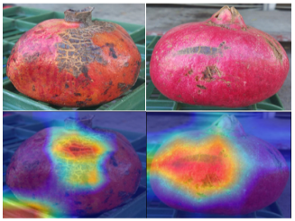

# Drama-Pod (DRAMA POmegranate Dataset)
This repository contains a dataset that proposed in the paper  "Visual Quality Inspection of Pomegranate Crop Using a Novel Dataset and Deep Learning" and consists of three quality classes of pomegranate fruit related to their postharvest intended use.



# Dataset Structure
The dataset follows the following structure: 
```
├── Dataset
    ├── QA_Class_1
         img1
         img2
         img3
         ...
    ├── QB_Class_2
         img1
         img2
         img3
         ...
    ├── QC_Class_3
         img1
         img2
         img3
         ...
```
    
# Citation
If you use our dataset in a scientific publication, please use the following bibtex citation:
```
Kalampokas, T., Mentizis, D., Vrochidou, E. et al. Connecting national flags – a deep learning approach. Multimed Tools Appl (2023).
https://doi.org/10.1007/s11042-023-15056-y
```
